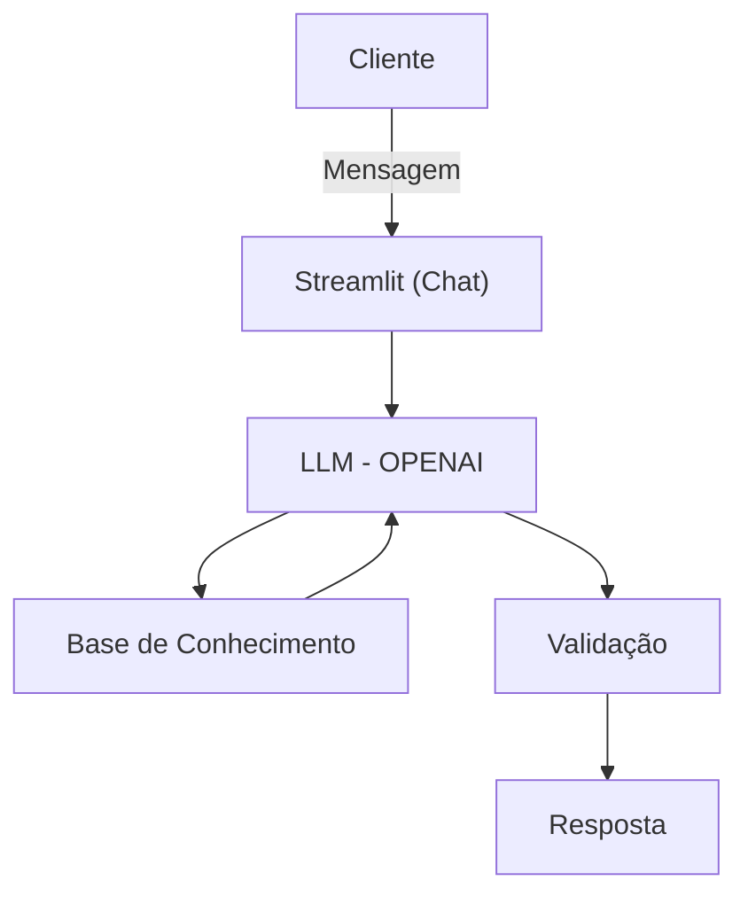

## Agente ADE: Gestor Pessoal Financeiro Inteligente

## 📌 Descrição

Este projeto utiliza Inteligência Artificial para analisar hábitos financeiros, classificar despesas automaticamente e gerar insights personalizados.


O Agente ADE (Gestor Pessoal Financeiro Inteligente) é uma solução proprietária de inteligência artificial generativa projetada para a gestão estratégica de finanças pessoais. Este projeto transforma dados financeiros brutos em inteligência acionável, atuando como um consultor autônomo que antecipa necessidades e personaliza sugestões de investimento com base no contexto real do usuário.

## ⚙️ Funcionalidades do agente ADE

✅ Classificação automática de despesas
✅ Análise de padrões de consumo
✅ Respostas inteligentes via LLM (OpenAI)
✅ Interface interativa com Streamlit (chat com o cliente)
✅ Gerar insights personalizados
✅ Só utiliza dados obtidos pelos arquivos da Base Conhecimento
✅ Comunicação Informal e acessível, educado, pró-ativo, atento
✅ Sempre pergunta se o cliente entendeu e se deseja mais explicações.
✅ Mantenha ética e conformidade regulatória.

❌ Anti-alucinação
❌ Não sugere aplicações financeiras
❌ Não responde a assuntos que não sejam financeiros
❌ NÃO faz suposições
❌ Se a informação não estiver no contexto, diga claramente que não sabe.

### Documentação complementar

✅ Documentação Agente: [`docs/01-documentacao-agente.md`](./docs/01-documentacao-agente.md)
✅ Base de Conhecimento:  [`docs/02-base-conhecimento.md`](./docs/02-base-conhecimento.md)
✅ Documentação Prompts: [`docs/03-prompts.md`](./docs/03-prompts.md)
✅ Documentação Métricas: [`docs/04-metricas.md`](./docs/04-metricas.md)
✅ Documentação Pitch: [`docs/04-pitch.md`](./docs/05-pitch.md)

## 🧠 Inteligência Artificial (OpenAI)

O núcleo do Agente ADE é alimentado pelo modelo gpt-4.1-mini da OpenAI, selecionado por suas capacidades técnicas superiores:

✅ Seguimento de Instruções: O gpt-4.1-mini oferece alta precisão na execução de diretrizes complexas e governança financeira.

✅ Janela de Contexto: Com suporte a até 1 milhão de tokens, o modelo processa simultaneamente extensos históricos de transações e catálogos de produtos.

✅ Consultoria Proativa: A LLM é configurada para cruzar dados do perfil do usuário com oportunidades de mercado, minimizando alucinações e garantindo respostas fundamentadas na base de conhecimento.

## 📊 Base de Conhecimento

A inteligência do agente é sustentada por uma infraestrutura de dados composta por quatro arquivos fundamentais localizados na pasta data/:

| Arquivo | Formato | Descrição |
|---------|---------|-----------|
| `transacoes.csv` | CSV | Histórico detalhado de movimentações para análise de fluxo de caixa. |
| `historico_atendimento.csv` | CSV |  Registro de interações anteriores para manutenção de contexto. |
| `perfil_investidor.json` | JSON |  Mapeamento de objetivos, tolerância a risco e horizonte temporal. |
| `produtos_financeiros.json` | JSON | Catálogo estruturado de serviços e investimentos para recomendações. |


###  Diagrama de Arquitetura



## 📁 Estrutura do Projeto

A organização do repositório segue a estrutura abaixo:
```
📁 dio-lab-bia-do-futuro

/
│
├── 📄 README.md
│
├── 📁 data/                          # Dados mockados para o agente
│   ├── historico_atendimento.csv     # Histórico de atendimentos (CSV)
│   ├── perfil_investidor.json        # Perfil do cliente (JSON)
│   ├── produtos_financeiros.json     # Produtos disponíveis (JSON)
│   └── transacoes.csv                # Histórico de transações (CSV)
│
├── 📁 docs/                          # Documentação do projeto
│   ├── 01-documentacao-agente.md     # Caso de uso e arquitetura
│   ├── 02-base-conhecimento.md       # Estratégia de dados
│   ├── 03-prompts.md                 # Engenharia de prompts
│   ├── 04-metricas.md                # Avaliação e métricas
│   └── 05-pitch.md                   # Roteiro do pitch
│
├── 📁 src/                           # Código da aplicação
│   └── app.py                        # (exemplo de estrutura)
│
├── 📁 assets/                        # Imagens e diagramas
│   └── ...
│
└── 📁 examples/                      # Referências e exemplos
    └── README.md
```
## 🛠️ Stack Tecnológica


| Arquivo | Descrição |
|---------|------------------------|
|Interface | Streamlit 1.28.0 (Dashboard e Chat Interativo). |
|Processamento| Pandas 3.0.0 e NumPy 2.4.1 |
| Validação | Pydantic 2.12.5 (Garantia de integridade dos dados). |

## 📦 Instalação e Execução


Clone o repositório:

```
bash
git clone https://github.com/ademarbarreto/dio-lab-bia-do-futuro.git
```

Configuração do Ambiente:
```
bash
python -m venv venv
source venv/bin/activate  # Windows: venv\Scripts\activate
pip install -r requirements.txt
```

Variáveis de Ambiente: Crie um arquivo .env na raiz do projeto:

```
bash
OPENAI_API_KEY=sua_chave_aqui
OPENAI_MODEL=gpt-4.1-mini
```

Iniciar a Aplicação:
```
bash
streamlit run app.py
```

## ✒️ Autor
Projeto desenvolvido por **Ademar Silva Barreto Junior** como uma solução original de gestão financeira inteligente baseada em IA Generativa.

Este repositório reflete o desenvolvimento completo de documentação e código do Agente ADE.

Linkedin: **https://www.linkedin.com/in/ademarsilvabarretojunior/**

