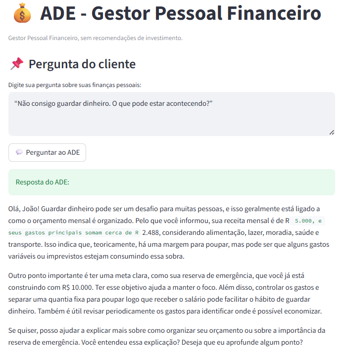

# Pitch (3 minutos)

> [!TIP]
> Você pode usar alguns slides pra apoiar no seu Pitch e mostrar sua solução na prática.
 
## Roteiro Sugerido

### 1. O Problema (30 seg)
> Qual dor do cliente você resolve?
> 
O ADE é um Assistente Digital de Investimentos criado para ajudar pessoas a organizarem melhor seus gastos e planejarem uma vida financeira mais equilibrada. 
Atualmente muitas pessoas enfrentam dificuldades para controlar suas finanças pessoais. Elas não sabem exatamente para onde o dinheiro está indo.
Sem esse controle, fica muito difícil ter uma reserva financeira para imprevistos, como uma demissão ou a perda de uma fonte de renda.
Não classificam corretamentesua s despesas mensais e acabam não conseguindo poupar.

### 2. A Solução (1 min)
> Como seu agente resolve esse problema?
> 
Para resolver esse problema, eu desenvolvi o ADE. O ADE é um Gestor Pessoal Financeiro
baseado em Inteligência Artificial.

Ele utiliza exclusivamente os dados financeiros do próprio cliente, como histórico de despesas
e informações básicas de renda.

Com esses dados, o ADE consegue:

- Classificar automaticamente as despesas,
- Resumir os gastos mensais,
- Analisar hábitos de consumo,
- Explicar, de forma simples,a importância de construir uma reserva financeira.
- Ele não recomenda investimentos, não sugere produtos financeiros e não toma decisões pelo cliente.

O objetivo do ADE é ajudar a pessoa a entender seus próprios hábitose refletir sobre como pode
melhorar sua organização financeira.

### 3. Demonstração (1 min)
> 

>Mostre o agente funcionando (pode ser gravação de tela)
>
O cliente interage com o ADE por meio de um chat simples.
Por exemplo,o cliente pergunta:

## Pergunta: “Não consigo guardar dinheiro. O que pode estar acontecendo?”

O ADE analisa os gastos disponíveis na base de conhecimento,  classifica as despesas por categoria e apresenta um resumo claro dos hábitos de consumo do cliente.

Todas as respostas do ADE são baseadas apenas nos dados fornecidos.

Se o usuário fizer uma pergunta fora do contexto financeiro ou sobre algo que não está na base,
o agente responde de forma educada que não possui informações suficientes.

Isso garante segurança e evita respostas incorretas.

### 4. Diferencial e Impacto (30 seg)
> Por que essa solução é inovadora e qual é o impacto dela na sociedade?

O principal diferencial do ADE é o uso responsável da Inteligência Artificial.

Ele possui mecanismos de validação contra alucinação, responde apenas sobre finanças pessoais,
e admite quando não sabe algo.

O impacto dessa solução é promover educação financeira acessível, ajudar pessoas a criarem
uma reserva de emergência, reduzir o descontrole financeiro e trazer mais tranquilidade
para o dia a dia.

#### Antes de investir melhor é preciso gastar melhor.

#### Esse é o propósito do ADE.

Muito obrigado.

---

## Checklist do Pitch

- [x] Duração máxima de 3 minutos
- [x] Problema claramente definido
- [x] Solução demonstrada na prática
- [x] Diferencial explicado
- [x] Áudio e vídeo com boa qualidade

---

## Link do Vídeo

> Cole aqui o link do seu pitch (YouTube, Loom, Google Drive, etc.)

[Link do vídeo]
